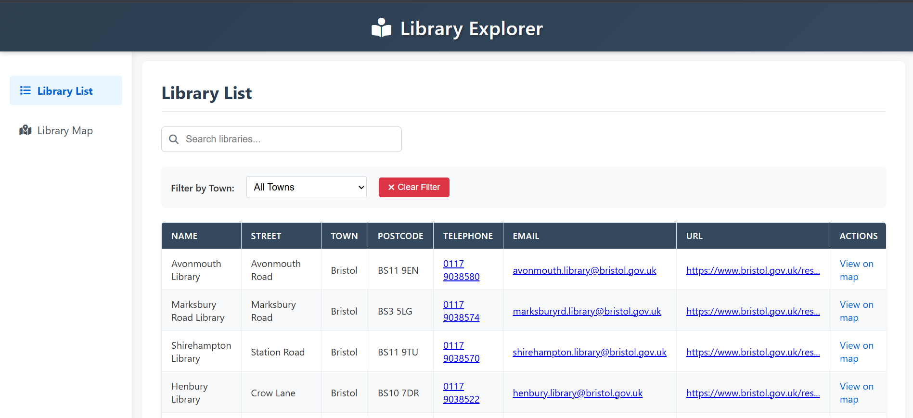
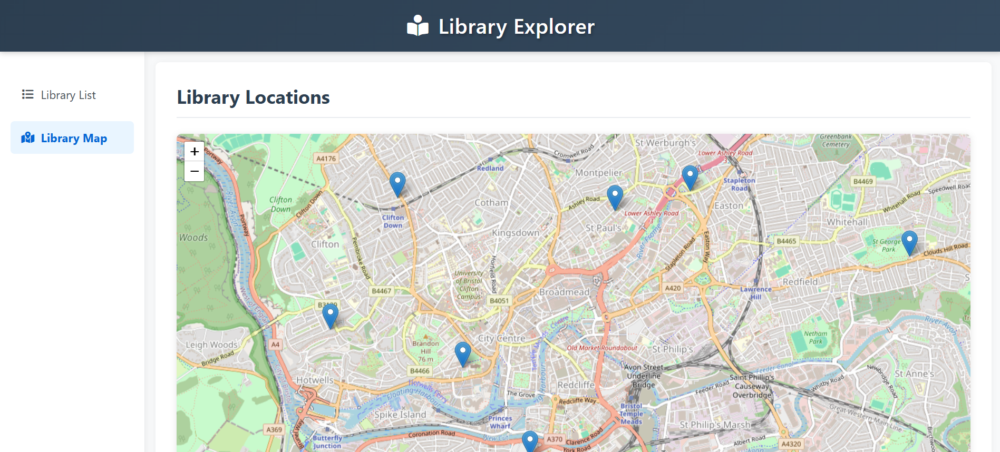

# Design

## User Interface Overview

The application features two main views: Library List, which displays libraries in a table format, and Library Map, which shows their locations on a map.

### Core Views

| View             | Purpose                         | Key Components                                                                                                            |
| ---------------- | ------------------------------- | ------------------------------------------------------------------------------------------------------------------------- |
| **Library List** | Browse/search library directory | - Sortable table - Search bar - Town filter - Distance sorting - "Find Nearest" button - Responsive layout |
| **Library Map**  | Visual location exploration     | - Interactive map - Location markers - User geolocation - Marker popups                                          |

_Table view with search and filtering capabilities_

_Map view with clustered markers and popup details_

### Wireframe

_Basic structure of the UI layout_

## Visual Design

### Color Scheme

| Role       | Color     | Usage                |
| ---------- | --------- | -------------------- |
| Primary    | `#2c3e50` | Headers, buttons     |
| Secondary  | `#0366d6` | Interactive elements |
| Background | `#f8f9fa` | Page background      |

### Typography

- **Primary font**: System UI stack (Segoe UI, Roboto, San Francisco)

## Component Specifications

### Table View

1. **Search Bar**
   - Instant filtering
   - Clear button
2. **Town Filter**
   - Dropdown selector
   - "Clear" option
   - Sortable
   - Find Nearest
3. **Data Table**
   - Zebra striping
   - Hover states
   - Mobile scrollable

### Map View

1. **Map Controls**
   - Zoom buttons
   - Geolocation button
2. **Library Markers**
   - Cluster groups
   - Info popups
3. **Location Indicator**
   - Accuracy radius
   - Pulse animation

## Responsive Behavior

| Breakpoint | Layout         | Notable Changes         |
| ---------- | -------------- | ----------------------- |
| >992px     | Sidebar + Main | Full table visible      |
| 768-992px  | Stacked        | Compact table           |
| <768px     | Mobile         | Horizontal table scroll |
