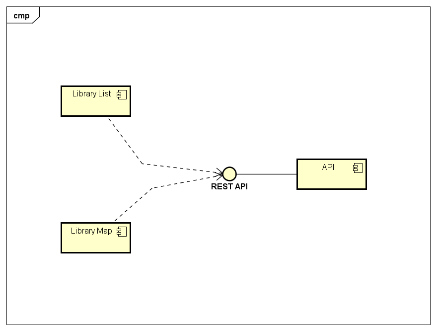
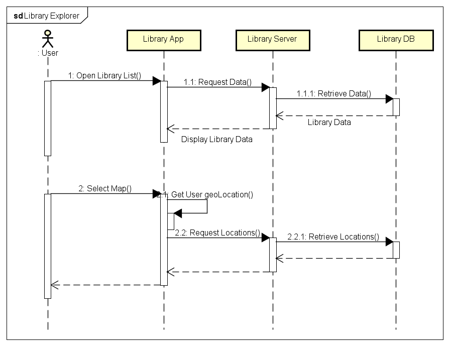
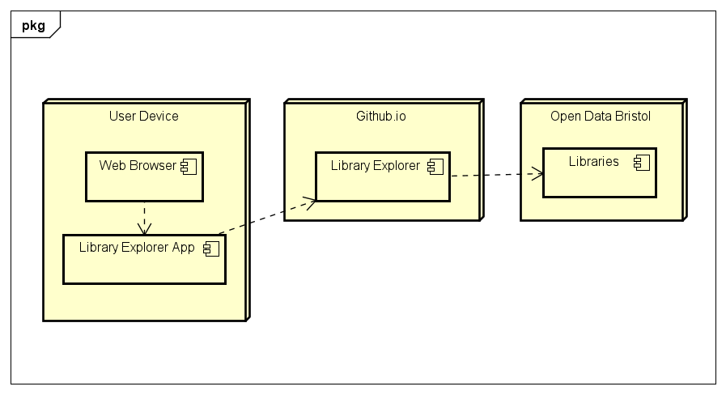
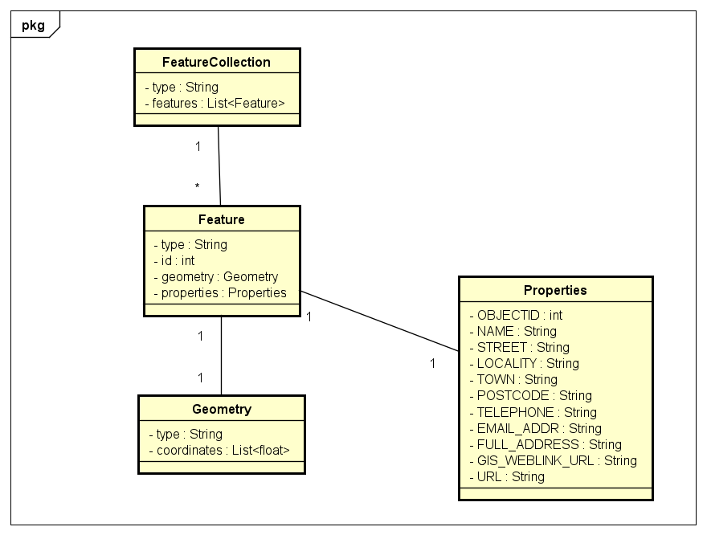
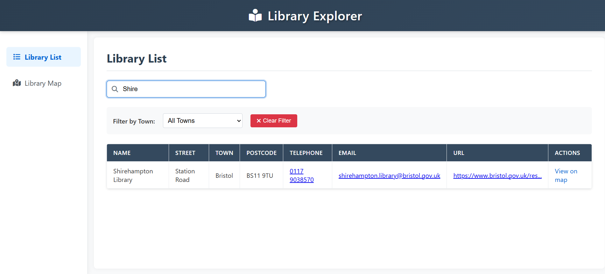
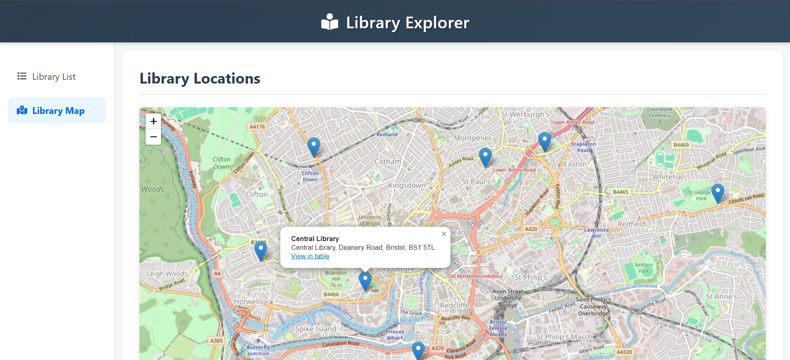

# Implementation

## Introduction

The system displays Bristol libraries using the Bristol Open Data API. It includes a Library List and a Library Map. The dataset provides library details like name, address, and contact info.

### Known Issues

- API response delays may occur.
- Some library records have NULL values.

### Configuration Data

- API Endpoint: https://maps2.bristol.gov.uk/server2/rest/services/ext/ll_leisure_and_culture/MapServer/0/query?outFields=*&where=1%3D1&f=geojson

## Project Structure

```
└── 📁Library-Explorer
    └── 📁app
        └── 📁css
            └── styles.css
        └── 📁js
            └── api.js
            └── libraryList.js
            └── libraryMap.js
        └── 📁pages
            └── libraryList.html
            └── libraryMap.html
    └── 📁docs
        └── .DS_Store
        └── design.md
        └── 📁images
        └── implementation.md
        └── planning.md
        └── requirements.md
        └── testing.md
    └── 📁tests
    └── .DS_Store
    └── readme.md
```

## Software Architecture

Follows a **Client-Server** model. Uses **HTML, CSS, JavaScript**, and **Leaflet** for maps.

### Components

1. **Library List** – Displays library data in a table with search functionality.
2. **Library Map** – Shows library locations with markers on the map.
3. **JavaScript Logic** – Fetches API data and manages UI interactions.

### Architectural Styles

- **RESTful API** for data retrieval
- **Component-based** front-end structure



## System Interactions

The interactions between the user, front-end, and API are depicted below.



## Deployment

The system will be hosted as a web application with a client-server model. The deployment model includes a front-end hosted on a web server, communicating with the Bristol Open Data API.



## Bristol Open Data API

### Query: Fetch All Libraries
<!-- Contributor:  M Z M Ajmal -->
#### URL

```
https://maps2.bristol.gov.uk/server2/rest/services/ext/ll_leisure_and_culture/MapServer/0/query?outFields=*&where=1%3D1&f=geojson
```

#### Response Sample

```json
{
  "type": "FeatureCollection",
  "features": [
    {
      "type": "Feature",
      "id": 1,
      "geometry": {
        "type": "Point",
        "coordinates": [-2.6984286857059017, 51.500095141959477]
      },
      "properties": {
        "OBJECTID": 1,
        "NAME": "Avonmouth Library",
        "STREET": "Avonmouth Road",
        "LOCALITY": "Avonmouth",
        "TOWN": "Bristol",
        "POSTCODE": "BS11 9EN",
        "TELEPHONE": "0117 9038580",
        "EMAIL_ADDR": "avonmouth.library@bristol.gov.uk",
        "FULL_ADDRESS": "Avonmouth Library, Avonmouth Road, Bristol, BS11 9EN.",
        "GIS_WEBLINK_URL": "https://bcc.maps.arcgis.com/apps/Embed/index.html?webmap=34d4096ad1bd44459ec928dbee17a411&feature=moving_home_5779;OBJECTID;1&center=0,0&level=7&scale=false&disable_scroll=false&logoimage=data:image/png;base64,...",
        "URL": "https://www.bristol.gov.uk/residents/libraries-and-archives/find-a-library/library-finder/library?id=1"
      }
    }
  ]
}
```
<!-- Contributor:  M Z M Ajmal -->


# User Guide

## Library List

1. Open **libraryList.html**.
2. The table loads library data.
   - 
3. Use the search box to filter results.
   - 

## Library Map

1. Click "View on map" in the library list.
2. The map page opens with the selected library.
   - 
3. Click markers to view details.
   - 

# Error Handling

- **API Failures**:

  - Network errors are caught and logged
  - User sees persistent table/map with last successful data
  - Console warnings for developers

- **Geolocation**:

  - Fallback to Bristol center coordinates
  - User notification via alert (non-blocking)

- **Data Validation**:
  - NULL checks for critical fields (name, coordinates)
  - Graceful degradation for missing optional fields
