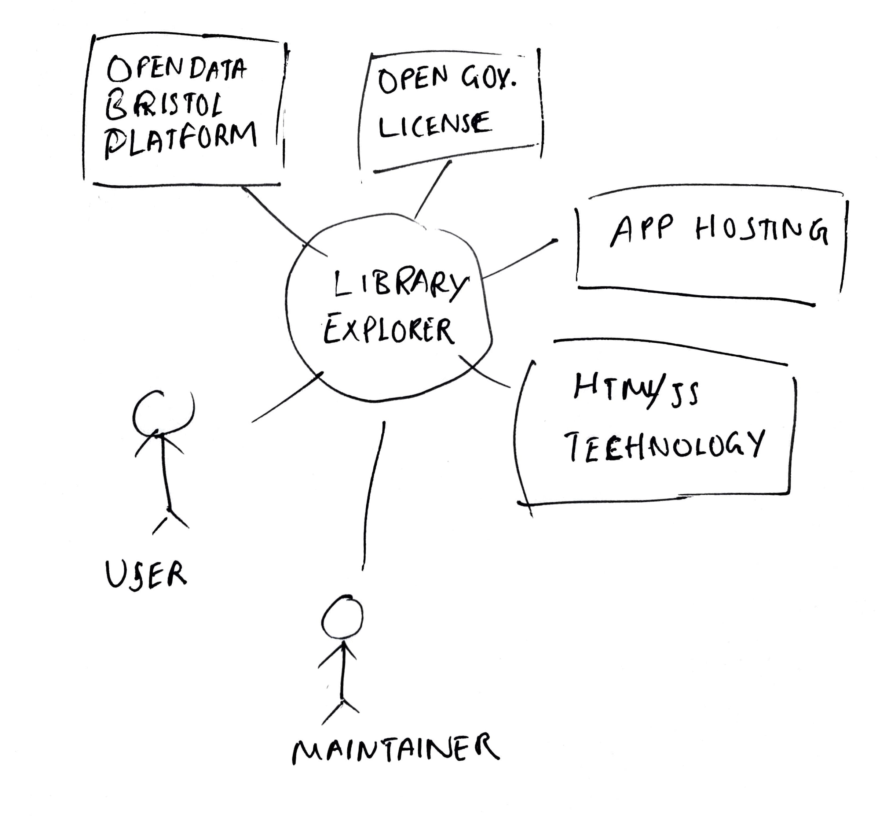

# Project Proposal

## Business Case

### Problem statement

There is no simple way for users to easily access and explore public library data in Bristol. This project aims to make this data accessible via a user-friendly web application.

### Business benefits

- Easy access to library data for users.
- Interactive map and table views for better navigation.
- Encourages engagement with local public resources.

### Options Considered

- Use of third-party apps that show basic data, but these lack customization.
- Building a more complex system with additional datasets from Bristol Open Data.

### Expected Risks

- Data inconsistencies in the API.
- API rate limits affecting performance.
- Ensuring compatibility across different browsers.

## Project Scope

- Display library data such as names, locations, and facilities.
- Show data on an interactive map and in a table format.
- Use JavaScript to fetch data from the Bristol Open Data API.
- Basic validation of the displayed data.

