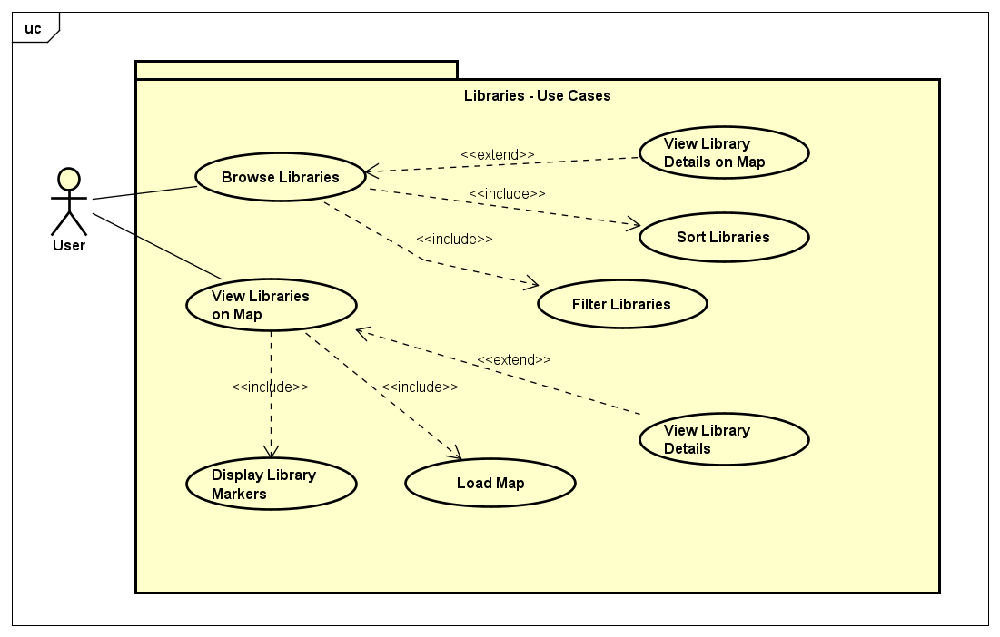

# Requirements

## User Needs

### User Stories

- As a **user**, I want to **search for a library by name, street, town, or postcode**, so that I can quickly find the library I am looking for.
- As a **user**, I want to **sort the library list by name, town, or distance**, so that I can easily organize the information based on my preference.
- As a **user**, I want to **find the nearest library based on my current location**, so that I can visit the closest one conveniently.
- As a **user**, I want to **view a library’s location on a map**, so that I can get directions and understand its surroundings.
- As a **user**, I want to **filter libraries by town**, so that I can see only the libraries in a specific area.

### Actors

- **User**: The primary actor who interacts with the website to browse library data.
- **Bristol Open Data API**: The external system providing the library data.

### Use Cases

| **Use-Case ID** | **Use-Case Name**     | **Contributor** |
| --------------- | --------------------- | --------------- |
| **UC1**         | Browse Libraries      | Rishon          |
| **UC2**         | View Libraries on Map | M Z M Ajmal     |

#### **UC1: Browse Libraries**

| **Description**    | The goal is to display a list of libraries in a table format, providing details such as name, location, and services.                                                                                               |
| ------------------ | ------------------------------------------------------------------------------------------------------------------------------------------------------------------------------------------------------------------- |
| **Actors**         | User                                                                                                                                                                                                                |
| **Assumptions**    | User has access to a working internet connection and the website is functional.                                                                                                                                     |
| **Steps**          | 1. User opens the website. 2. User selects the "Browse Libraries" option. 3. The website queries the Bristol Open Data API for library data. 4. The website displays the retrieved data in a table format. |
| **Variations**     | - User can sort the table by columns such as name, location, or service. - User can filter the table by location or services.                                                                                    |
| **Non-functional** | - The system must load the library data within 2 seconds. - The table should be mobile-responsive.                                                                                                               |
| **Issues**         | - Ensure proper data validation before displaying the library information.                                                                                                                                          |

#### **UC2: View Libraries on Map**

| **Description**    | The goal is to display library locations on an interactive map for easier visualization of nearby libraries.                                                                                                                                   |
| ------------------ | ---------------------------------------------------------------------------------------------------------------------------------------------------------------------------------------------------------------------------------------------- |
| **Actors**         | User                                                                                                                                                                                                                                           |
| **Assumptions**    | User has access to a working internet connection and the website is functional.                                                                                                                                                                |
| **Steps**          | 1. User opens the website. 2. User selects the "View Libraries on Map" option. 3. The website queries the Bristol Open Data API for library location data. 4. The website displays the libraries on an interactive map using markers. |
| **Variations**     | - User can click on a marker to view detailed library information. - User can zoom and pan the map for better view.                                                                                                                         |
| **Non-functional** | - The map must load within 3 seconds. - The map must be responsive to different screen sizes.                                                                                                                                               |
| **Issues**         | - Ensure proper error handling if the map data is incomplete or unavailable.                                                                                                                                                                   |

---

## Software Requirements Specification

### Functional Requirements

- **FR1**: The system shall allow users to browse libraries in a table format with search/filter capabilities. (From UC1)
- **FR2**: The system shall display libraries on an interactive map with markers. (From UC2)
- **FR3**: The system shall retrieve library data from Bristol Open Data API. (From both UC1 and UC2)
- **FR4**: The system shall request and use geolocation to center the map on the user. (From UC2)
- **FR5**: The system shall display library details when markers are clicked. (From UC2)
- **FR6**: The system shall sort libraries by distance from user when "Find Nearest" is clicked (From UC1)

### Non-Functional Requirements

- **NFR1**: Performance:
  - Table data shall load within 3 seconds (From UC1)
  - Map shall load within 3 seconds (From UC2)
  - All user actions shall respond within 5 seconds (From UC1/UC2)
- **NFR2**: Compatibility:
  - Shall be mobile-responsive for both table and map views (From UC1/UC2)
  - Shall support Chrome and Safari browsers (From UC1/UC2)
- **NFR3**: Robustness:
  - Shall default to Bristol City Centre if geolocation fails (From UC2)
  - Markers shall not obscure map area (From UC2)
- **NFR4**: Usability:
  - Shall provide clear visual distinction of selected libraries (From UC1)
  - Shall maintain intuitive search/filter interactions (From UC1)

---

<!-- Contributor:  Rishon -->

## Use Case Model: Library List

| **Use Case Model**    | **Library List**               |
|-----------------------|--------------------------------|
| **Use Case Name**      | View and Interact with Library List |
| **Actor**              | User                           |
| **Goal**               | To view a list of libraries, search for specific libraries, filter by town, and navigate to the map view for a selected library. |
| **Preconditions**      | 1. The user has navigated to the "Library List" page.   2. The application has successfully fetched and loaded the library data. |
| **Postconditions**     | 1. A table displaying the list of libraries with their details (Name, Street, Town, Postcode, Telephone, Email, URL, Actions) is presented to the user. |
| **Main Flow**          | 1. The user navigates to the "Library List" page.   2. The application fetches and displays the list of libraries in a tabular format.   3. The user can see the name, street, town, postcode, telephone, email, and website URL for each library.   4. The user can see a "View on map" link for each library. |
| **Alternative Flows**  | **Search for Libraries:** The user enters a search term, and the list is filtered in real-time.   **Filter by Town:** The user selects a town, and the list shows libraries in that town.   **Clear Filter:** The user resets the search and filter.   **View Library on Map:** The user clicks the "View on map" link for a library to navigate to the map page. |
| **Exception Flows**    | **No Libraries Found:** A "No libraries found" message is displayed.   **Error Fetching Data:** An error message is displayed if data fetching fails. |
| **Trigger**            | The user navigates to the "Library List" page or interacts with the search/filter functionalities. |

<!-- Contributor:  M Z M Ajmal -->

## Use Case Model: Library Map

| **Use Case Model**    | **Library Map**                |
|-----------------------|--------------------------------|
| **Use Case Name**      | View Library Locations on Map  |
| **Actor**              | User                           |
| **Goal**               | To view the locations of libraries on an interactive map and see details of specific libraries. |
| **Preconditions**      | 1. The user has navigated to the "Library Map" page.   2. The Leaflet map library has been successfully loaded.   3. The application has successfully fetched and loaded the library data. |
| **Postconditions**     | 1. An interactive map is displayed, centered on the user's location or Bristol.   2. Markers are displayed for each library. |
| **Main Flow**          | 1. The user navigates to the "Library Map" page.   2. The application fetches the library data and displays markers for each library.   3. Clicking on a marker displays the library's details. |
| **Alternative Flows**  | **View Specific Library from List:** The user navigates from the "Library List" page and sees the selected library's details.   **Geolocation Not Supported/Failed:** The map centers on Bristol if geolocation fails. |
| **Exception Flows**    | **Error Fetching Data:** An error message or an empty map may be shown if data fetching fails. |
| **Trigger**            | The user navigates to the "Library Map" page or clicks "View on map" from the Library List. |
